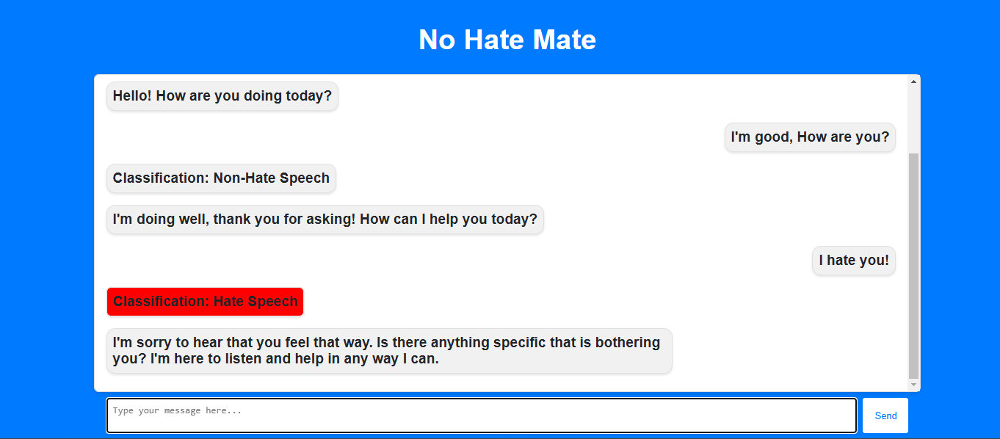
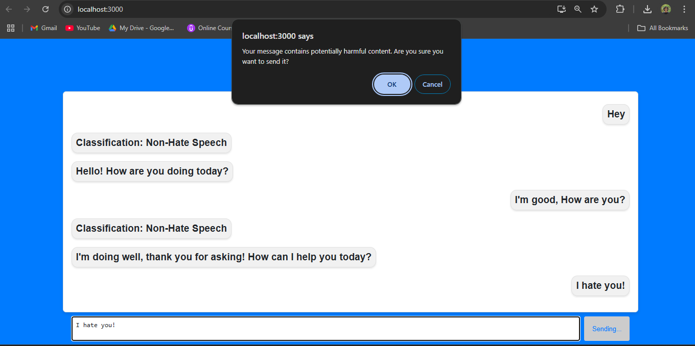
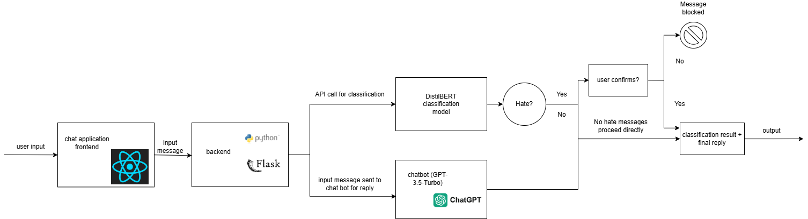

# No Hate Mate

No Hate Mate is a chat application designed to identify and manage hateful or harmful content. It uses a combination of machine learning models and natural language processing to ensure that users communicate in a respectful and constructive manner.

---

## Screenshots

### Home Page

## Features

- Real-time Hate Speech Classification: Messages are analyzed using a DistilBERT classification model to determine if they contain hate speech.
- Chatbot Interaction: A GPT-3.5-based chatbot replies to user messages, ensuring engaging and meaningful interactions.
- User Warnings: If a message is classified as hate speech, users are warned before sending the message.
- Customizable UI: User-friendly interface with responsive design elements.

---

## Architecture diagram

## Project Architecture

### Flow

- User Input: A user types a message in the chat interface.

- Frontend (React): The message is sent to the backend via API.

- Backend (Flask): 
    - The message is passed to the DistilBERT model for classification.
    - If classified as hate speech, the user is warned.
    - The message is also sent to GPT-3.5-Turbo for a reply.

- Output:
    - If classified as hate and the user confirms, the message and chatbot reply are displayed.
    - If classified as hate and user does not confirm, the message is blocked.
    - If not classified as hate, the chatbot reply is displayed.

## Technologies Used
- Frontend: React.js
- Backend: Flask (Python)
- Classification Model: DistilBERT (pre-trained model from Hugging Face)
- Chatbot: GPT-3.5-Turbo (OpenAI API)

## Setup

### Prerequisites

- Node.js and npm
- Python (>= 3.8)
- Virtual Environment (optional)

### Installation 

- Clone the repository -> git clone https://github.com/your-username/no-hate-mate.git

- Backend Setup ->
    - Navigate to the backend folder: cd backend
    - Install dependencies: pip install -r requirements.txt
    - Run the flask server: flask run

- Frontend Setup ->
    - Navigate to the frontend folder: cd ../frontend
    - Install dependencies: npm install
    - Start the React application: npm start

## Usage

- Open the application in your browser (default: http://localhost:3000).
- Type a message in the input field and press Enter or click Send.
- If the message is classified as hate speech:
    - A warning will be displayed, allowing you to confirm or block the message.
- View the chatbot’s reply and classification results in the chat window.

### **Contributing**
Contributions are welcome! Follow these steps to contribute:

1. Fork the repository.

2. Create a new branch:
    git checkout -b feature-name

3. Commit your changes:
    git commit -m "Description of changes"

4. Push to your branch:
    git push origin feature-name

5. Open a pull request.

## **Contact**
For any questions or suggestions, feel free to reach out:

Email: y.kulkarni2000@gmail.com
GitHub: yash-kulkarni2000